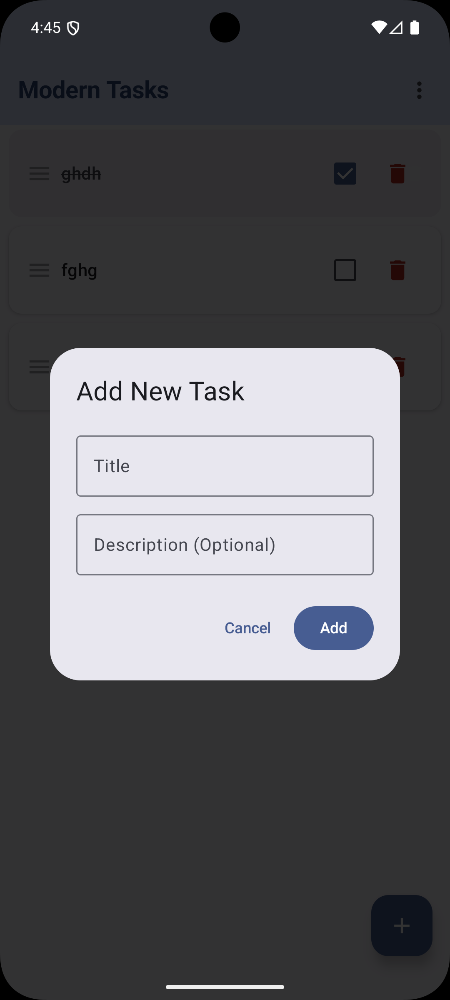

# 📝 Modern Tasks

A beautiful, modern ToDo application built with **Jetpack Compose** and **Clean Architecture** principles. This project demonstrates professional Android development practices including MVVM architecture, dependency injection with Hilt, and local data persistence with Room.

## ✨ Features

- ✅ **Create, Edit, and Delete Tasks** - Full CRUD operations
- ✅ **Task Completion Tracking** - Mark tasks as done with smooth animations
- ✅ **Drag and Drop Reordering** - Long-press and drag to reorder tasks
- ✅ **Smart Sorting** - Sort by date, alphabetically, completion status, or manual order
- ✅ **Swipe to Delete** - Intuitive gesture with visual feedback
- ✅ **Empty State** - Beautiful UI when no tasks exist
- ✅ **Data Persistence** - Tasks saved locally with Room database
- ✅ **Modern UI** - Material 3 design with dark/light theme support
- ✅ **Smooth Animations** - Polished entrance and state transition animations

## 🏗️ Architecture

This app follows **Clean Architecture** and **MVVM** pattern:

```
app/
├── data/              # Data layer
│   ├── TodoDao        # Room DAO
│   ├── TodoDatabase   # Room Database
│   └── TodoRepository # Repository pattern
├── di/                # Dependency Injection
│   └── AppModule      # Hilt module
├── model/             # Data models
│   └── TodoItem       # Task entity
├── ui/                # Presentation layer
│   ├── components/    # Reusable composables
│   ├── theme/         # Material 3 theming
│   └── TodoViewModel  # ViewModel with StateFlow
└── MainActivity       # Entry point
```

## 🛠️ Tech Stack

- **Language**: Kotlin
- **UI Framework**: Jetpack Compose
- **Architecture**: MVVM + Clean Architecture
- **Dependency Injection**: Hilt
- **Database**: Room Persistence Library
- **Async**: Kotlin Coroutines & Flow
- **Design**: Material 3

## 📦 Dependencies

```kotlin
// Jetpack Compose
implementation("androidx.compose.ui:ui")
implementation("androidx.compose.material3:material3")
implementation("androidx.activity:activity-compose:1.9.3")

// Room Database
implementation("androidx.room:room-runtime:2.6.1")
implementation("androidx.room:room-ktx:2.6.1")
ksp("androidx.room:room-compiler:2.6.1")

// Hilt Dependency Injection
implementation("com.google.dagger:hilt-android:2.51.1")
ksp("com.google.dagger:hilt-compiler:2.51.1")
implementation("androidx.hilt:hilt-navigation-compose:1.2.0")

// Lifecycle & ViewModel
implementation("androidx.lifecycle:lifecycle-viewmodel-compose:2.8.7")
```

## 🚀 Getting Started

### Prerequisites

- Android Studio Koala (2024.1.1) or later
- JDK 11 or higher
- Android SDK 24+

### Installation

1. Clone the repository:
```bash
git clone https://github.com/YourUsername/ModernTasks.git
```

2. Open the project in Android Studio

3. Sync Gradle and build the project

4. Run on an emulator or physical device

## 📱 Screenshots

<p align="center">
  
  
  
</p>

## 🎯 Key Learnings

This project demonstrates:

- ✅ Modern Android UI with Jetpack Compose
- ✅ Reactive programming with Kotlin Flow
- ✅ Dependency injection with Hilt
- ✅ Local data persistence with Room
- ✅ MVVM architecture pattern
- ✅ Material 3 design implementation
- ✅ Advanced Compose animations
- ✅ Gesture handling (swipe-to-dismiss, drag-and-drop)

## 🔮 Future Enhancements

- [ ] Task categories and tags
- [ ] Due dates and reminders
- [ ] Search and filter functionality
- [ ] Cloud sync with Firebase
- [ ] Widget support
- [ ] Export/Import tasks

## 👨‍💻 Author

**Keren Lint**

- Learning Path: 2026 Mobile AI Master Plan
- Focus: Modern Android Development + AI/ML Integration

## 📄 License

This project is part of a learning journey and is available for educational purposes.

---

**Built with ❤️ using Jetpack Compose**
